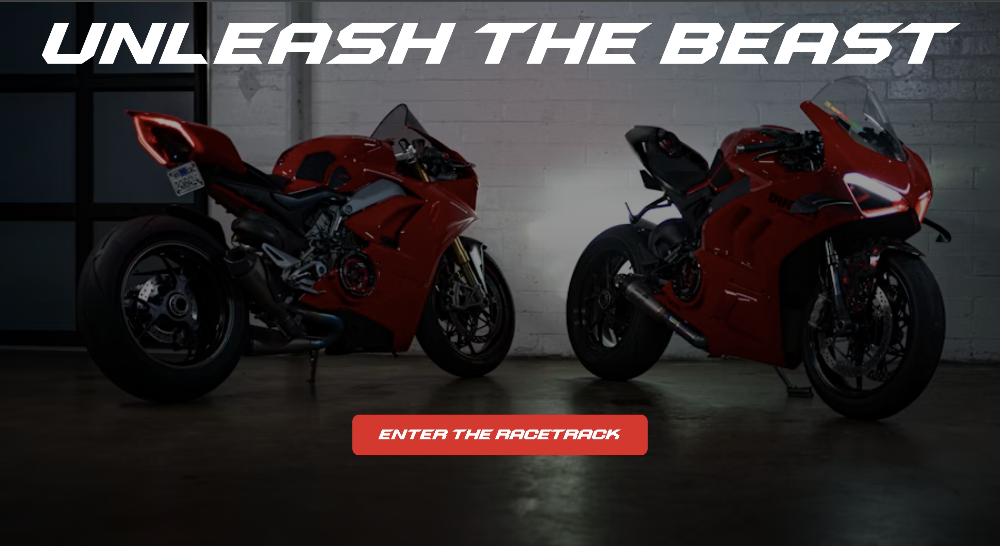

# Racing Landing Page 🏁

A **racing-themed landing page** for the website **"Unleash the Beast"**, built with **HTML and CSS**, featuring a bold background, custom font, and eye-catching button. Perfect for practicing **CSS styling, gradients, and layout design**.

---

## Demo



---

## Features

- Full-screen **background image** with **linear gradient overlay**  
- **Custom font** applied via `@font-face`  
- **CSS Gradients:** Linear, Radial, and Conic  
- **Responsive layout** using CSS Flexbox  
- Bold heading and call-to-action **button**  
- Clean **margin & padding** control for spacing  

---

## Installation

1. Clone the repository:  
```bash
git clone https://github.com/<your-username>/racing-landing-page.git
```

2. Open index.html in your browser.

3. Ensure the font file (Sprintura Demo.otf) is placed in the correct folder.

